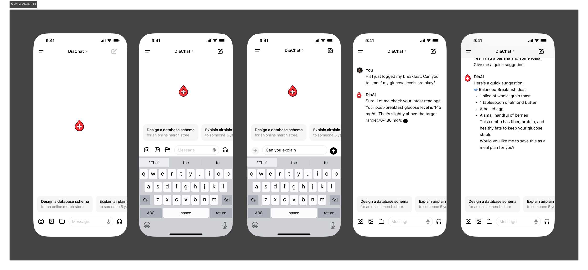

# DiabetIQ: An Intelligent Diabetes Management Application with an Integrated LLM-Augmented Chatbot and Machine Learning-Driven Early Risk Prediction

## Overview 
DiabetIQ is an intelligent diabetes management application that integrates a Large Language Model (LLM)-augmented Retrieval-Augmented Generation (RAG) chatbot with a machine learning-based early risk prediction system. Designed to enhance both patient engagement and clinical insight, the chatbot delivers personalized, context-aware responses grounded in verified medical literature, ensuring accurate and up-to-date guidance. Simultaneously, the ML module analyzes user health data to predict potential complications such as hypo- or hyperglycemia, enabling timely intervention. Together, these components create a cohesive, AI-driven ecosystem for personalized diabetes care, bridging the gap between reliable conversational support and proactive risk management.

## DiabetIQ: App UI

## App Workflow & Architecture

